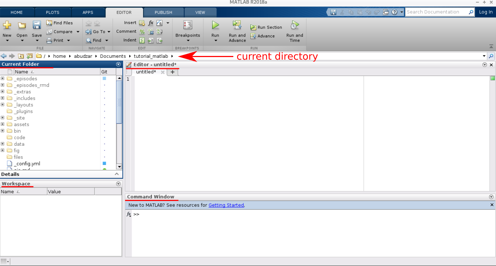
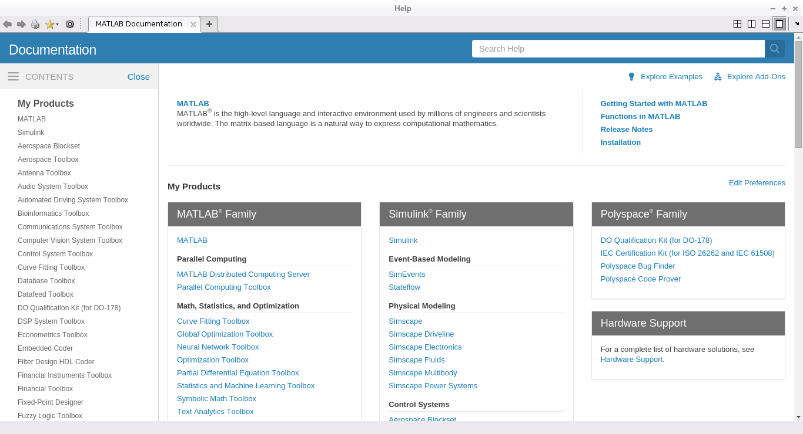
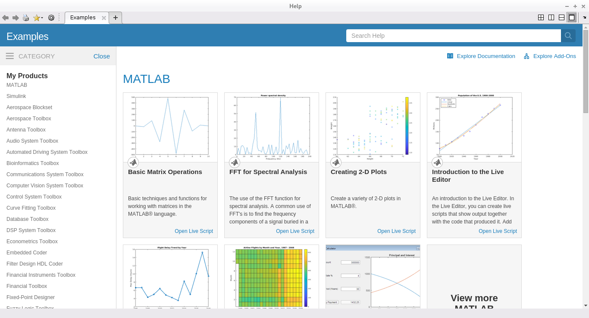

**MATLAB** adalah singkatan dari **MATrix LABoratory**, artinya pengolahan dalam Matlab dilakukan dalam bentuk matriks M xN dan vektor M x 1.

Berikut adalah tampilan dasar dari Matlab:

   
**Current directory**: Direktori yang sedang aktif saat ini.

**Current Folder**: Folder yang sedang aktif saat ini.

**Editor**: Folder yang sedang aktif saat ini.

**Workspace**: Variabel - variabel yang aktif akan berada disini.

**Command Window**: Tempat *command line*. Mirip *command prompt* jika di windows atau *terminal* di Linux

---

Ketik *command line* berikut di *Command Window*,

~~~
>> doc
~~~
{: .bash}

maka akan muncul *window **Help*** seperti yang ditunjukkan pada gambar berikut.

  
Dari gambar tersebut diatas, anda dapat melihat bahwa Matlab telah dilengkapi berbagai macam toolbox-toolbox (lu liat sendiri lah cok). Dengan toolbox - toolbox yang telah disediakan oleh Matlab ini, anda mampu melakukan proses-proses matematika dan komputasi, menganalisa data, mengembangkan sebuah algoritma, melakukan simulasi dan pemodelan, serta dapat memvisualisasikan hasil-hasilnya. *Window **Help*** ini akan sangat membantu nantinya, *so feel free to explore it!*

---

Ketik *command line* berikut di *Command Window*,

~~~
>> demo
~~~
{: .bash}

maka akan muncul *window **Example***. Anda dapat mencoba beberapa contoh penggunaan *software* Matlab di *window* ini.

